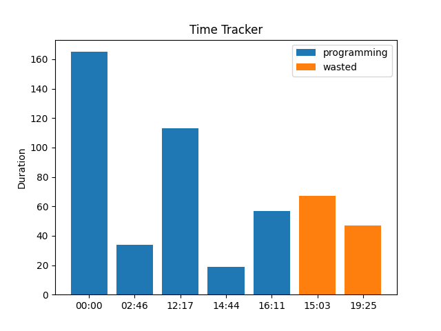

# Habit Cracker

A simple tool to track and manage your habits, make new ones and possibly eliminate old and bad ones.

This tool leverages the [timew](https://github.com/GothenburgBitFactory/timewarrior) tool, which is the real brain and motivator behind this project(got to know about it while watching vimmer Timothee Chalamet, thanks), it helps you manage your projects or anything for that sake and keep track of how much time you spend doing a particular thing.

### What does Habit Cracker do?

It simply talks to the timew in the backend and puts that data into a database and displays the data to you in a 2d plotted graph([matplotlib](https://github.com/matplotlib/matplotlib)).

#### Screenshots:

### Install

#### Prerequisits
- python
- uv or any other virtual env setup(optional but preffered)

#### Instructions
- Install the requirements using the `requirements.txt` file

- run `main.py`

### TODO
- [ ] Fix plot order
- [ ] Add GUI Interface
